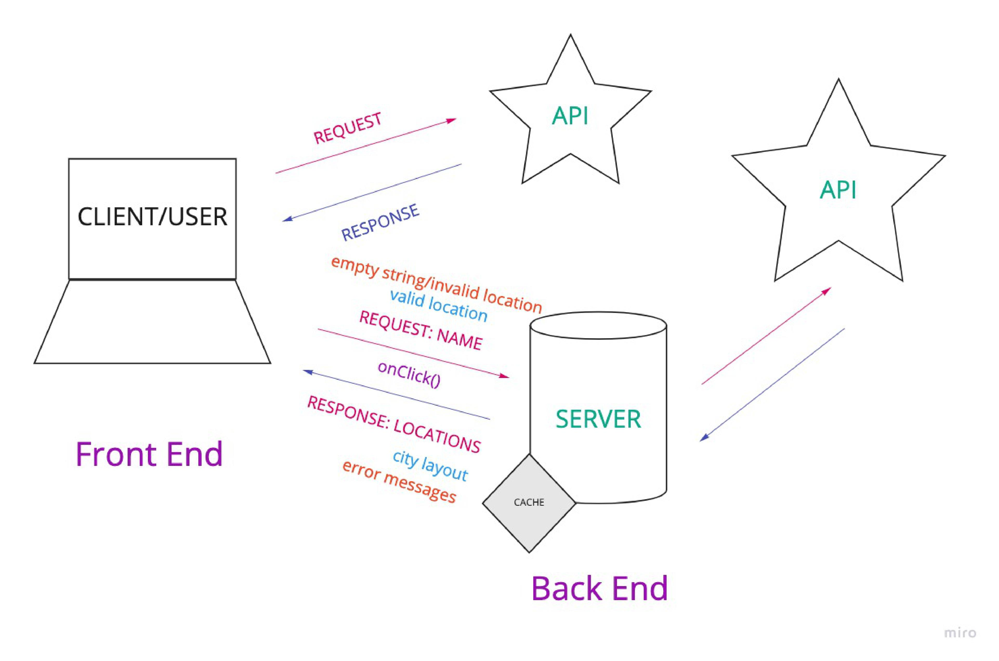

# City-Explorer

**Author:** Stephanie Marie Hill
**Version:** 1.0.0

## Overview
Bringing back the browser map finder, we're coming for you MapQuest!

## Getting Started
<!-- What are the steps that a user must take in order to build this app on their own machine and get it running? -->

## Architecture
<!-- Provide a detailed description of the application design. What technologies (languages, libraries, etc) you're using, and any other relevant design information. -->

## Change Log
<!-- Use this area to document the iterative changes made to your application as each feature is successfully implemented. Use time stamps. Here's an example:

01-01-2001 4:59pm - Application now has a fully-functional express server, with a GET route for the location resource. -->

## Credit and Collaborations
<!-- Give credit (and a link) to other people or resources that helped you build this application. -->

### Lab 06 WRRC:

### Lab 07 WRRC:

### Lab 08 WRRC:

## Time Estimates:

Name of feature: 

Estimate of time needed to complete: 

Start time: 

Finish time: 

Actual time needed to complete: